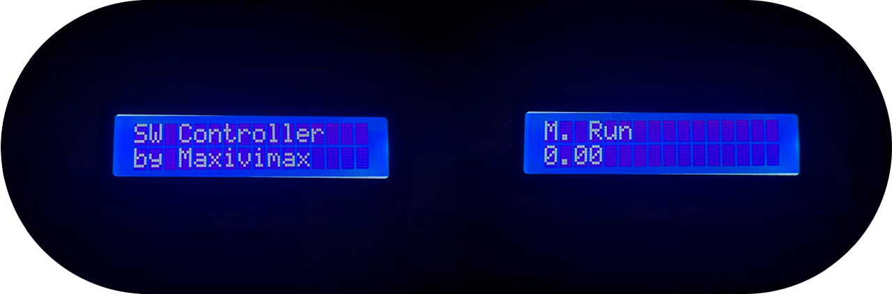

# SWController
 

[RU](https://github.com/maxivimax/SWController/blob/main/README.md)/[EN](https://github.com/maxivimax/SWController/blob/main/READMEen.md)

> Система управления аппаратом точечной сварки

## Функции

//Тут записать функционал//

## Необходимые модули

Для сборки необходимы:
+ Arduino Uno (Nano)
+ Экран 16x2
+ Энкодер
+ Реле
+ Потенциометр (Для настройки контраста дисплея)
+ Кнопка (В случае если энкодер без кнопки)

## Установка

Для начала установите библиотеки:
+ [EncButton](https://github.com/GyverLibs/EncButton)
+ [microWire](https://github.com/GyverLibs/microWire)
+ [LiquidCrystal](https://github.com/arduino-libraries/LiquidCrystal)
+ SimpleMenu16PIN ([MeatBallDev/SimpleMenu16PIN](https://github.com/MeatBallDev/SimpleMenu16PIN))

## Подключение

//Тут описать подключение//

## Использование

После запуска появится главный экран. Недобходимо 1 раз нажать на энкодер/кнопку.
После этого у Вас откроется меню с такими пунктами:
+ Run
+ M. run
+ Profiles
+ Min. time
+ Max. time
+ Info

Пройдемся по функциональным пунктам :)

### Run
***W.I.P.*** Запуск сварки с помощью одного из профилей работы.

### M. run
Запуск сварки на указанное время. (В пределах минимального/максимального)

### Profiles
***W.I.P.*** Создание/редактирование профилей работы.

### Min. time
Тут указывается минимально возможное время сварки.

### Max. time
Тут указывается максимально возможное время сварки.

## Планы на будущее

Некоторые планы на данный проект \m/
- [ ] Закончить работу над профилями металлов.
- [ ] Добавить иконки для упрощенного использования.
- [ ] Добавить возможность включать сварку, пока удерживается энкодер.
- [ ] Сделать 3D модель универсального корпуса.

## Обратная связь

Если у Вас есть идеи для новых функций, вопросы и т.д. пишите в "issues" или мне в соц. сети. Я обязательно вам отвечу ;)
+ [VK (Maxivimax)](https://vk.com/maxivimax)
+ [Telegram (Maxivimax)](https://t.me/maxivimax)
